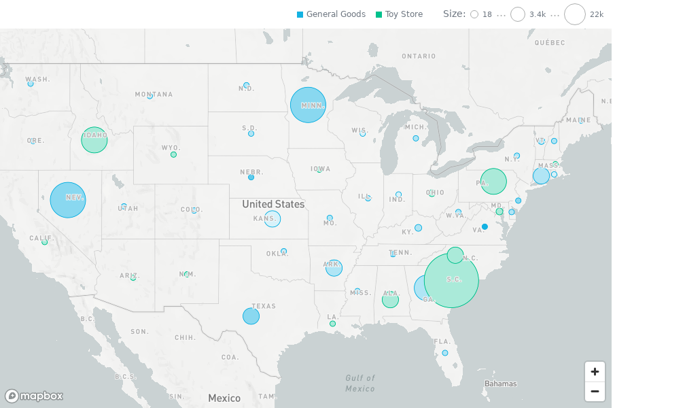

Geo pushpin chart visualizes data broken down by geographic region across an actual map and points the latitude and longitude of locations.



## Structure

```jsx
import '@gooddata/react-components/styles/css/main.css';
import { GeoPushpinChart } from '@gooddata/react-components';

<GeoPushpinChart
    projectId={<project-id>}
    location={<attribute>}
    size={<measure>}
    color={<measure>}
    segmentBy={<attribute>}
    config={<geo-config>}
    sdk={<sdk>}
    …
/>
```

## Example

```jsx
import '@gooddata/react-components/styles/css/main.css';
import { GeoPushpinChart } from '@gooddata/react-components';

const population = {
    measure: {
        localIdentifier: 'populationIdentifier',
        definition: {
            measureDefinition: {
                item: {
                    identifier: populationIdentifier
                }
            }
        },
        format: '#,##0'
    }
}

const density = {
    measure: {
        localIdentifier: 'densityIdentifier',
        definition: {
            measureDefinition: {
                item: {
                    identifier: densityIdentifier
                }
            }
        },
        format: '#,##0'
    }
}

const usStateLocation = {
    visualizationAttribute: {
        displayForm: {
            identifier: 'usStateLocationIdentifier'
        },
        localIdentifier: usStateLocationIdentifier
    }
};

const usStateName = {
    visualizationAttribute: {
        displayForm: {
            identifier: 'usStateNameIdentifier'
        },
        localIdentifier: usStateNameIdentifier
    }
};

const age = {
    visualizationAttribute: {
        displayForm: {
            identifier: ageIdentifier
        },
        localIdentifier: 'ageIdentifier'
    }
};

const config = {
    mapboxToken: 'your_mapbox_token',
    tooltipText: usStateName
};

<div style={{ height: 600, width: 900 }}>
    <GeoPushpinChart
        projectId={projectId}
        location={usStateLocation}
        size={population}
        color={density}
        segmentBy={age}
        config={config}
    />
</div>
```

## Properties

| Name | Required? | Type | Description |
| :--- | :--- | :--- | :--- |
| projectId | true | string | The project ID |
| location | true | [Attribute](afm.md#attribute) | An attribute definition that determines the longitude and latitude of the pins |
| segmentBy | false | [Attribute](afm.md#attribute) | An attribute definition that categorizes the pins |
| size | false | [Measure](afm.md#measure) | A measure definition that determines the size of the pins |
| color | false | [Measure](afm.md#measure) | A measure definition that determines color saturation of the pins |
| filters | false | [Filter[]](filter_visual_components.md) | An array of filter definitions |
| config | true | [GeoConfig](#geo-config) | The geo chart configuration object |
| locale | false | string | The localization of the chart. Defaults to `en-US`. For other languages, see the [full list of available localizations](https://github.com/gooddata/gooddata-react-components/tree/master/src/translations). |
| sdk | false | SDK | A configuration object where you can define a custom domain and other API options |
| ErrorComponent | false | Component | A component to be rendered if this component is in error state |
| LoadingComponent | false | Component | A component to be rendered if this component is in loading state |
| onError | false | Function | A callback when the component updates its error state |
| onExportReady | false | Function | A callback when the component is ready for exporting its data |
| onLoadingChanged | false | Function | A callback when the component updates its loading state |

<!-- These internals are intentionally undocumented
| afterRender | false | Function | A callback after component is rendered |
| dataSource | false | DataSource class | A class that is used to resolve AFM |
| environment | false | string | An Internal property that changes behaviour in Analytical Designer and KPI Dashboards |
| height | false | number | Height of the component in pixels |
| pushData | false | Function | A callback after AFM is resolved |
-->

## Geo Config
| Name | Required? | Type | Description |
| :--- | :--- | :--- | :--- |
| mapboxToken | true | string | A map access token that the chart uses to render the map requiring such a token <br> To create a Mapbox account and an access token, see [this guide](https://docs.mapbox.com/help/how-mapbox-works/access-tokens/). |
| points | false | GeoPointsConfig | A configuration object where you can define clustering and the minimum and maximum sizes of the pins |
| viewport | false | GeoConfigViewport | The region that the viewport should focus on after the chart is rendered |
| tooltipText | false | [Attribute](afm.md#attribute) | An additional item that shows a user-friendly label for the location attribute instead of the longitude and latitude |

For the common chart configuration options such as colors, separators, or legend visibility, see [Chart Config](chart_config.md).

The following example shows the supported `geoConfig` structure with sample values:

```javascript
{
    points: {
        minSize: '0.5x', // '0.5x' | '0.75x' | 'normal' | '1.25x' | '1.5x'  
        maxSize: '1.5x', // '0.5x' | '0.75x' | 'normal' | '1.25x' | '1.5x'
        groupNearbyPoints: true
    },
    viewport: {
        // 'auto' // default, Include all data
        // 'continent_af' // Africa
        // 'continent_as' // Asia
        // 'continent_au' // Australia
        // 'continent_eu' // Europe
        // 'continent_na' // North America
        // 'continent_sa' // South America
        // "world";
        area: 'world',
    },
    tooltipText: {
        visualizationAttribute: {
            displayForm: {
                identifier: 'usStateNameIdentifier'
            },
            localIdentifier: usStateNameIdentifier
        }
    },
    colors: ['rgb(195, 49, 73)', 'rgb(168, 194, 86)'],
    colorPalette: [{
        guid: '01',
        fill: {
            r: 195,
            g: 49,
            b: 73
        }
    }, {
        guid: '02',
        fill: {
            r: 168,
            g: 194,
            b: 86
        }
    }],
    colorMapping: [{
        predicate: (headerItem) => {
            return headerItem.attributeHeaderItem && (headerItem.attributeHeaderItem.name === 'adult'); // age
        },
        color: {
            type: 'guid',
            value: '02'
        }
    }],
    legend: {
        enabled: true,
        position: 'top',
    },
    separators: {
        thousand: ',',
        decimal: '.'
    }
}
```
